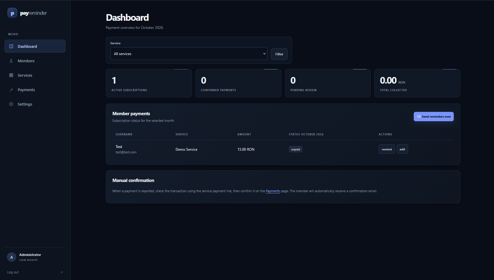
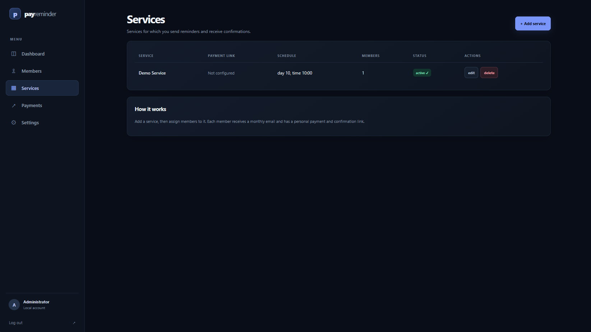
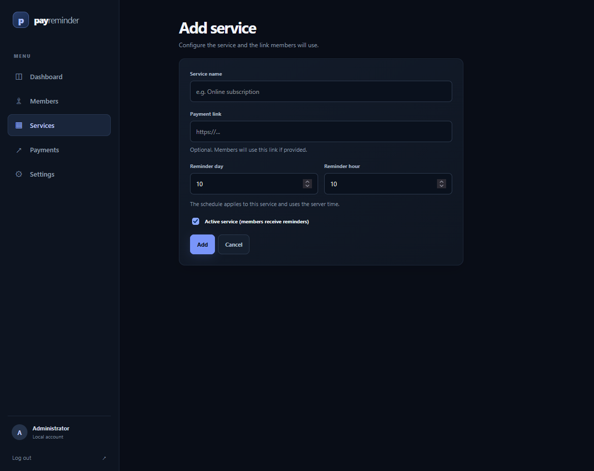
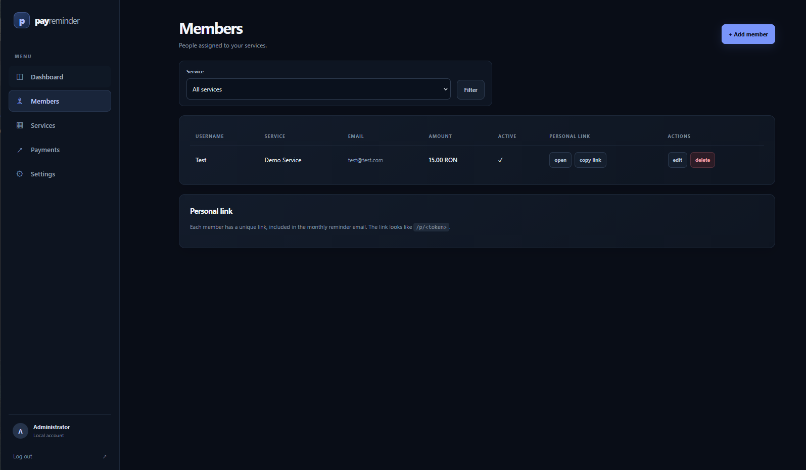
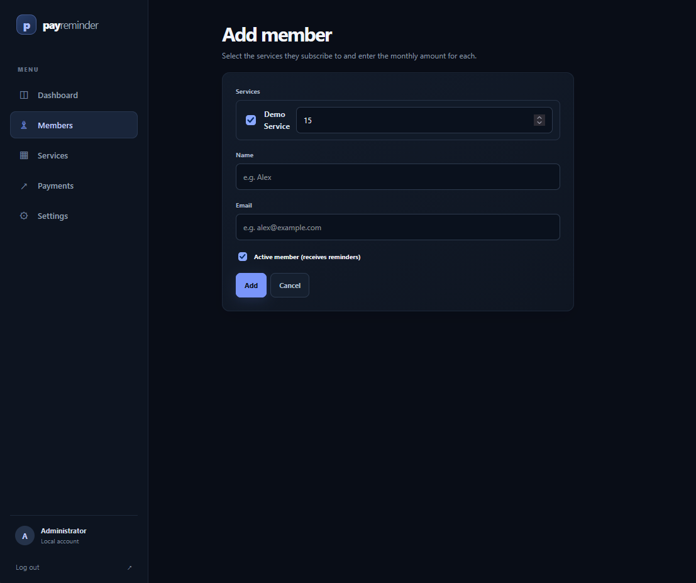
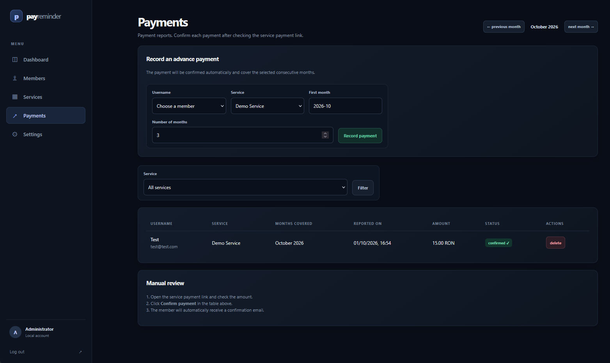
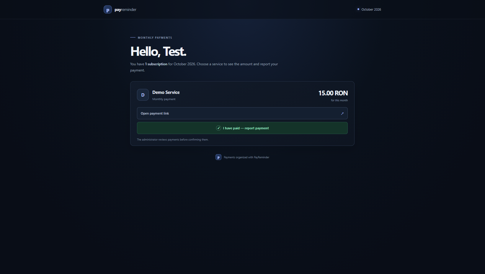

# PayReminder

PayReminder helps you track recurring payments for multiple services. Create services, assign members to one or more services, send monthly reminders, and review payment reports from an admin panel.

PayReminder does **not** charge cards or process payments. Members pay through the payment link configured for a service. An administrator checks the transaction and confirms it in PayReminder.

## Features

- Multiple services, each with its own payment link, active status, and reminder schedule.
- Members can be assigned to multiple services, with a separate monthly amount for each.
- Automatic and manual reminder emails. A member subscribed to several services receives one reminder email per service; each email links to the member's personal page.
- A personal page where members can see their subscriptions, open the relevant payment link, and report a payment.
- Optional Telegram and Discord webhook notifications when a member reports a payment, configured directly in **Admin → Settings** with a separate active switch for each agent.
- Manual payment confirmation and optional confirmation emails to members.
- Optional advance payments covering multiple consecutive months.
- Romanian and English interface and email templates. Choose the language in **Admin → Settings**.
- Local JSON storage; no external database is required.

## Screenshots

<details>
<summary>Show screenshots</summary>

### Admin dashboard



### Services list



### Add or edit a service



### Members list



### Add or edit a member



### Payments and advance payments



### Member payment page



</details>

## Requirements

- Node.js 18 or newer and npm.
- Linux installation script: Debian or Ubuntu in an LXC container, with root access. Do not run the installer on the Proxmox host.
- An SMTP account to send email. Telegram and Discord notifications are optional.
- For public access, a domain and an HTTPS reverse proxy such as Caddy or Nginx.

## Quick start

```bash
npm install
cp .env.example .env
npm start
```

On Windows PowerShell, copy the environment file with:

```powershell
Copy-Item .env.example .env
```

Before using the application, edit `.env`. Set a strong `ADMIN_PASSWORD`, a long random `SESSION_SECRET`, the correct `APP_URL`, and your SMTP details. Without SMTP credentials, the app starts but does not send emails. Configure optional Telegram and Discord notifications from **Admin → Settings → Notifications**; new installations do not need notification variables in `.env`.

Open:

- Admin panel: <http://localhost:3000/admin>
- Public home page: <http://localhost:3000>

The default local admin username is `admin`. Set your own username and password in `.env` before exposing the app to a network.

## Install on Debian or Ubuntu LXC

Run these commands **inside** the LXC container, not on the Proxmox host:

```bash
apt-get update
apt-get install -y git ca-certificates curl
git clone https://github.com/geolup2000/payreminder.git /opt/payreminder
cd /opt/payreminder
chmod +x install.sh
./install.sh /opt/payreminder
```

The installer installs Node.js 22 if Node.js 18 or newer is not already available, installs production npm dependencies, creates `.env` from `.env.example` if needed, prompts for a public `APP_URL` when the current value is localhost, initializes the application language to English for a new installation, and creates/enables the `payreminder` systemd service when systemd is available.

The service may start before SMTP is configured. Edit the generated `.env`, then restart the service:

```bash
nano /opt/payreminder/.env
systemctl restart payreminder
systemctl status payreminder
```

View logs with:

```bash
journalctl -u payreminder -f
```

If the container does not use systemd, start the app manually from the project directory:

```bash
cd /opt/payreminder
node src/server.js
```

### Expose the app safely

For public access, point a reverse proxy at the app's local port (default `3000`) and enable HTTPS. Set `APP_URL` to the public HTTPS URL, for example `https://reminder.example.com`; this URL is used in member emails and payment notifications. Restrict direct access to the app port at the firewall so public traffic goes through the HTTPS proxy.

The installer does not configure DNS, HTTPS, a reverse proxy, or firewall rules.

## Configuration

`.env.example` documents the environment variables for server, admin, email, and payment defaults. Language and notification agents are configured in **Admin → Settings**. The most important environment settings are:

| Variable | Purpose |
| --- | --- |
| `PORT` | Local HTTP port; defaults to `3000`. |
| `APP_URL` | Public application URL used to build member and admin links. |
| `ADMIN_USER` | Admin panel username; defaults to `admin`. |
| `ADMIN_PASSWORD` | Admin panel password. Set a unique, strong value. |
| `SESSION_SECRET` | Secret used to sign admin sessions. Use a long, random value. |
| `SMTP_HOST`, `SMTP_PORT` | SMTP server hostname and port. Use the values from your email provider; port `587` with STARTTLS is typical. |
| `SMTP_USER`, `SMTP_PASS` | SMTP login. Both are required to enable email sending. |
| `SMTP_FROM_NAME`, `SMTP_FROM_ADDRESS` | Optional sender display name and address. If the address is blank, the SMTP username is used. |
| `CURRENCY` | Currency label shown in the app; defaults to `RON`. |
| `DEFAULT_AMOUNT` | Suggested amount when adding a member; defaults to `15`. |
| `DEFAULT_SERVICE_NAME` | Name of the initial service; defaults to `Service`. |
| `SEND_CONFIRM_TO_MEMBER` | Whether payment confirmation emails are sent; defaults to `true`. |

The application language is stored in `data/settings.json` and changed from **Admin → Settings**. The Linux installer sets English for a new installation and preserves a previously selected Romanian or English language. A manual installation without an existing language setting starts in Romanian; choose the language from the admin panel.

### Configure SMTP

Enter the SMTP host, port, username, and password provided by your email service. Many providers require an app password or SMTP access to be enabled. The example file leaves SMTP values blank intentionally. If `SMTP_USER` or `SMTP_PASS` is missing, email sending is disabled.

The app uses STARTTLS (`requireTLS`) and a non-secure SMTP connection upgraded with TLS, commonly on port `587`. Check your provider's SMTP documentation if it requires different settings.

### Configure notifications (optional)

Open **Admin → Settings → Notifications**, choose **Telegram** or **Discord**, and check **Active** to show its configuration fields. Each agent is enabled independently, so both can be active. Unchecking Active hides the fields and preserves their values. Save to apply changes immediately, without restarting.

- **Telegram:** create a bot with `@BotFather`, copy its token into `TELEGRAM_BOT_TOKEN`, and enter the destination chat ID in `TELEGRAM_CHAT_ID`. Make sure the bot can send messages to that chat.
- **Discord:** create a webhook under the channel's **Integrations → Webhooks** settings and enter `DISCORD_WEBHOOK_URL`. Set **Application name** to the sender name shown in Discord (up to 80 characters; defaults to `PayReminder`). The avatar automatically uses the PayReminder favicon, served as a PNG at `APP_URL/favicon.png`. Set `APP_URL` to a publicly accessible HTTPS address so Discord can load it; no image URL needs to be entered.

Configuration is stored in `data/settings.json`. Existing notification variables in `.env` are used until you first save these settings; afterward, the saved settings take priority and those variables can be removed from `.env`. Include settings.json in backups and keep it private: it contains notification credentials.

The agent selector only changes which configuration is displayed; it does not disable the other agent. To enable both, select Telegram, check **Active** and fill in its fields, then select Discord and do the same. Click **Save settings** to save both configurations together. To disable an agent, select it, uncheck **Active**, and save. Its credentials remain available if you enable it again later. Active Telegram requires both fields, and active Discord requires a valid Discord webhook URL.

Notifications use the Romanian or English language selected in **Admin → Settings**, including the message text, month, amount formatting, and confirmation link label. They include the member, service, amount, month, and admin confirmation link. Language changes apply to subsequent notifications immediately after saving. Failure on one channel does not prevent the other from sending. Discord messages suppress mentions. See the [Discord webhook documentation](https://docs.discord.com/developers/resources/webhook#execute-webhook).

## First-time setup in the admin panel

1. Sign in at `/admin`.
2. Open **Services** and edit the initial service or add another. Enter its payment URL, set the reminder day and hour, and make sure it is active.
3. Open **Members**, add each person, and select their services. Enter the monthly amount for each service and provide a working email address.
4. Open **Settings** and choose Romanian or English. The selection controls both the application interface and member emails. Under **Notifications**, optionally configure and activate Telegram, Discord, or both, then save.
5. Use **Payments** to review reported payments and record advance payments.

No payment links are preconfigured. Verify each service's payment URL before inviting members.

## Reminder and payment workflow

1. At the configured day and hour for an active service, PayReminder checks for members who are active, subscribed to that service, and have no payment recorded for the current month.
2. It sends each matching member a service-specific email with the amount and a link to their personal page.
3. The member opens the service's payment link and reports the payment from their personal page.
4. PayReminder optionally sends Telegram and/or Discord notifications to the admin. The notification is informational; it does not verify the transaction.
5. The admin checks the payment with the service provider and confirms it in **Payments** or from the dashboard.
6. If enabled, PayReminder sends the member a confirmation email.

Reminder day and hour are configured separately for each service and use the server's local timezone. Keep the app running continuously for scheduled reminders. The scheduler checks once per minute. If the server is down at the configured time, the reminder is not guaranteed to be sent later that day.

Advance payments are recorded as confirmed and cover the selected consecutive months. The amount is calculated from the member's configured monthly amount multiplied by the number of months.

## Admin pages

| Path | Purpose |
| --- | --- |
| `/admin` | Payment overview, service filter, quick reminders, and manual confirmation actions. |
| `/admin/services` | Add, edit, activate/deactivate, and schedule services. |
| `/admin/members` | Manage members, service assignments, amounts, and personal links. |
| `/admin/payments` | Filter payment reports, confirm or remove records, and record advance payments. |
| `/admin/settings` | Choose the application and email language; configure and activate Telegram and Discord notifications, including the Discord application name and automatic favicon avatar. |

## Data, backups, and updates

All application data is stored as JSON files in `data/`:

- `services.json` — services and reminder schedules;
- `members.json` — member details and service assignments;
- `payments.json` — reported and confirmed payments;
- `settings.json` — language preference, notification agent settings and credentials, and reminder bookkeeping.

Back up the entire `data/` directory and `.env` regularly. Both `.env` and `data/settings.json` contain credentials and secrets; keep them private and do not commit them to Git. Restoring the data directory and matching `.env` restores the local application state, including saved notification configurations.

To update an existing Linux installation, first make sure any local changes are committed or backed up, then pull and restart:

```bash
cd /opt/payreminder
git pull
npm ci --omit=dev
systemctl restart payreminder
```

If `git pull` reports local changes would be overwritten, inspect them before discarding or stashing anything. For example, `git diff -- install.sh` shows local installer changes.

## Troubleshooting

- **Emails are not sent:** Check `SMTP_HOST`, `SMTP_PORT`, `SMTP_USER`, and `SMTP_PASS`; review `journalctl -u payreminder -f`. Emails are disabled when SMTP credentials are missing.
- **Discord notifications are missing:** In **Admin → Settings → Notifications**, select Discord, make sure **Active** is checked, verify the webhook URL, and save. Make sure the webhook still exists and can post to the channel, and inspect the service logs. If the avatar is missing, check that `APP_URL/favicon.png` is publicly accessible.
- **Telegram notifications are missing:** In **Admin → Settings → Notifications**, select Telegram, make sure **Active** is checked, verify the bot token and chat ID, and save. Make sure the bot can message the configured chat, and inspect the service logs.
- **Links point to localhost or the wrong host:** Set `APP_URL` to the public HTTPS address and restart the service.
- **Scheduled reminders do not run:** Keep the service active, check the server timezone, confirm the service is active, and review its reminder day/hour and logs.
- **Admin login stops working after a restart:** Admin sessions are stored in memory, so a restart requires signing in again.
- **A Git update is blocked by local edits:** Inspect the reported files with `git diff`; commit, back up, or stash the changes before pulling.

## Development

```bash
npm install
npm run dev
```

Run notification configuration and delivery tests with `npm test`.

`npm run dev` starts Node's watch mode. The application is built with Express and EJS, uses `node-cron` for reminders, and uses Nodemailer for SMTP email.
